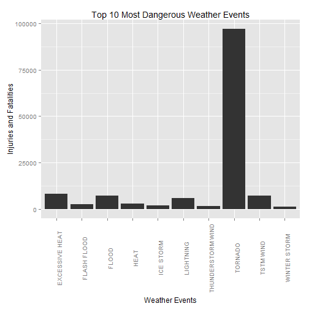
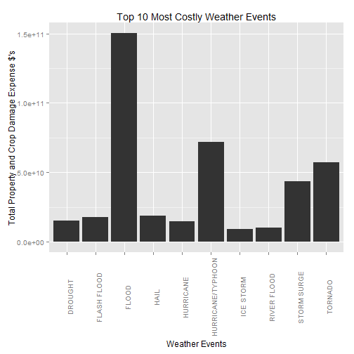

Severe Weather - Health and Economic Impact Analysis
====================================================

## Synopsis
This analysis uses storm data from the National Weather Service accumulated between 1950 and 2011 to determine which weather events cause the highest number of injuries and fatalities, and which weather events cause the most expensive damage. After reading the data, a number of manipulation techniques were applied to summarize the data by type, including ddply, reassignment of character variables, and some simple arithmetic. 
Some findings from this analysis:
-  Tornadoes cause the highest number of total injuries and fatalities in the U.S.
-  Excessive heat, although it occurs less often than tornadoes, causes a relatively high number of injuries and fatalites per event.
-  Flooding causes the highest total damage expense, 
-  Hurricanes and Typhoons, although the occur less frequently than flooding, causes a relatively high number of expense per event.  

#####  Notes and Assumptions
- repdata-data-StormData.csv is in the working directory
- the "plyr" package has been installed
- the "ggplot2" package has been installed

## Data Processing

#### Loading the Data

Read the data.  stringsAsFactors = FALSE makes it easier to work with the expense magnitude variable

```r
storms = read.csv("repdata-data-StormData.csv", stringsAsFactors = FALSE)
```


#### Data Transformations

##### Finding the events that cause the most injuries and fatalities
Each row represents a single weather event - assign a variable EVENTCOUNT to tally the events.  Sum the number of injuries and the number of fatalities.

```r
library(plyr)
storms$EVENTCOUNT = 1
injuriesumm = ddply(storms, "EVTYPE", summarize, nbr_injuries = sum(INJURIES), 
    nbr_fatalities = sum(FATALITIES), Event_Occurrences = sum(EVENTCOUNT))
```


Create a new variable representing the sum of injuries and fatalities.  Calculate the number of injuries and fatalities for each event. 

```r
injuriesumm$inj_n_fatal = injuriesumm$nbr_injuries + injuriesumm$nbr_fatalities
injuriesumm$inj_n_fatal_per = injuriesumm$inj_n_fatal/injuriesumm$Event_Occurrences
```


Order the dataset by the most fatal/injurious weather events

```r
totalMostDangerous = injuriesumm[with(injuriesumm, order(-inj_n_fatal), ), ]
MostDangerousPerEvent = injuriesumm[with(injuriesumm, order(-inj_n_fatal_per), 
    ), ]
```


Create a dataset limited to only the ten most dangerous events

```r
top10MostDangerous = totalMostDangerous[1:10, ]
top10MostDangerousPerEvent = totalMostDangerous[1:10, ]
```


##### Finding the events that cause the most expensive damage

Sum PROPDMGEXP (property damage) and CROPDMGEXP (crop damage) for an analysis of total damage expenses

##### Converting damage values (DMG) to consistent numeric values 
From page 12 of the [Storm Data Documentation] (https://d396qusza40orc.cloudfront.net/repdata%2Fpeer2_doc%2Fpd01016005curr.pdf) "Alphabetical characters used to signify magnitude include "K" for thousands, "M" for millions, and "B" for billions.""

Although K,M, and B are explained, other PROPDMGEXP/CROPDMGEXP values such numeric values between 0 and 8 are not explained.  Because our goal is to understand the most signigicant event types for damage expenses (rather than the total damage of all events or event types), we will ignore those rows where the notation is not: blank, k,K,m,b or B. 

Convert PROPDMGEXP and CROPDMGEXP to uppercase Character values

```r
storms$PROPDMGEXP <- toupper(storms$PROPDMGEXP)
storms$CROPDMGEXP <- toupper(storms$CROPDMGEXP)
```


Remove rows from the dataset where PROPDMGEXP/CROPDMGEXP does not equal null (1), K (thousands), M (millions), or B (billions)

```r
storms = subset(storms, storms$PROPDMGEXP == "" | storms$PROPDMGEXP == "K" | 
    storms$PROPDMGEXP == "M" | storms$PROPDMGEXP == "B")
storms = subset(storms, storms$CROPDMGEXP == "" | storms$CROPDMGEXP == "K" | 
    storms$CROPDMGEXP == "M" | storms$CROPDMGEXP == "B")
```


Replace the nulls,K's, M's, and B's with a value we can use in a multiplication expression

```r
storms$PROPDMGEXP[storms$PROPDMGEXP == ""] <- 1
storms$PROPDMGEXP[storms$PROPDMGEXP == "K"] <- 1000
storms$PROPDMGEXP[storms$PROPDMGEXP == "M"] <- 1e+06
storms$PROPDMGEXP[storms$PROPDMGEXP == "B"] <- 1e+09

storms$CROPDMGEXP[storms$CROPDMGEXP == ""] <- 1
storms$CROPDMGEXP[storms$CROPDMGEXP == "K"] <- 1000
storms$CROPDMGEXP[storms$CROPDMGEXP == "M"] <- 1e+06
storms$CROPDMGEXP[storms$CROPDMGEXP == "B"] <- 1e+09
```


Covert back to numeric so that we can use them in a multiplication

```r
storms$PROPDMGEXP <- as.numeric(storms$PROPDMGEXP)
storms$CROPDMGEXP <- as.numeric(storms$CROPDMGEXP)
```


Create a new variable representing the dollar value of the damage - take the value in in PROPDMG/CROPDMG multiplied by the value we derived above

```r
storms$PROPDMGDOLLARS <- storms$PROPDMG * storms$PROPDMGEXP
storms$CROPDMGDOLLARS <- storms$CROPDMG * storms$CROPDMGEXP
```


Add the property damage and crop damage values for an event total damage figure

```r
storms$TOTDMGDOLLARS <- storms$PROPDMGDOLLARS + storms$CROPDMGDOLLARS
```


Each row represents a single event (for each row, EVENTCOUNT =1).  We may want to know not just the total damage for all events of a particular type, but the damage per event.  Add a variable to use in counting the occurences of each event. 

```r
storms$EVENTCOUNT <- 1
```


Now we can summarize the dataset by the total amount of damage for all events, as well as the amount of damage per event

```r
damagesumm = ddply(storms, "EVTYPE", summarize, tot_dmg_exp = sum(TOTDMGDOLLARS), 
    Event_Occurrences = sum(EVENTCOUNT))
damagesumm$dmg_per_event = damagesumm$tot_dmg_exp/damagesumm$Event_Occurrences
```


There are hundreds of event types in our summary dataset, and we're only interested in the most costly events. Sort the data in descending order for both total cost and cost per event, creating a separate dataset for each limited to the 5 most costly events.

```r
totalMostCostly = damagesumm[with(damagesumm, order(-tot_dmg_exp), ), ]
mostCostlyPerEvent = damagesumm[with(damagesumm, order(-dmg_per_event), ), ]
```


```r
top10MostCostly = totalMostCostly[1:10, ]
```


## Results

#### The most dangerous weather events

Graph of the most dangerous weather events

```r
library(ggplot2)
g = ggplot(top10MostDangerous, aes(EVTYPE, inj_n_fatal))
g = g + ylab("Injuries and Fatalities")
g = g + xlab("Weather Events")
g = g + geom_bar(stat = "identity")
g = g + ggtitle("Top 10 Most Dangerous Weather Events")
g = g + theme(axis.text.x = element_text(angle = 90))
print(g)
```

 


Top 10 Most Dangerous - table of values

```r
top10MostDangerous
```

```
##                EVTYPE nbr_injuries nbr_fatalities Event_Occurrences
## 834           TORNADO        91346           5633             60652
## 130    EXCESSIVE HEAT         6525           1903              1678
## 856         TSTM WIND         6957            504            219940
## 170             FLOOD         6789            470             25326
## 464         LIGHTNING         5230            816             15754
## 275              HEAT         2100            937               767
## 153       FLASH FLOOD         1777            978             54277
## 427         ICE STORM         1975             89              2006
## 760 THUNDERSTORM WIND         1488            133             82563
## 972      WINTER STORM         1321            206             11433
##     inj_n_fatal inj_n_fatal_per
## 834       96979         1.59894
## 130        8428         5.02265
## 856        7461         0.03392
## 170        7259         0.28662
## 464        6046         0.38378
## 275        3037         3.95958
## 153        2755         0.05076
## 427        2064         1.02891
## 760        1621         0.01963
## 972        1527         0.13356
```


#### The most costly weather events

Graph of the most dangerous =expensive events

```r
library(ggplot2)
g = ggplot(top10MostCostly, aes(EVTYPE, tot_dmg_exp))
g = g + ylab("Total Property and Crop Damage Expense $'s")
g = g + xlab("Weather Events")
g = g + geom_bar(stat = "identity")
g = g + ggtitle("Top 10 Most Costly Weather Events")
g = g + theme(axis.text.x = element_text(angle = 90))
print(g)
```

 


Top 10 Most Costly - table of values

```r
top10MostCostly
```

```
##                EVTYPE tot_dmg_exp Event_Occurrences dmg_per_event
## 168             FLOOD   1.503e+11             25325       5935624
## 407 HURRICANE/TYPHOON   7.191e+10                88     817201282
## 830           TORNADO   5.730e+10             60628        945140
## 666       STORM SURGE   4.332e+10               261     165990579
## 241              HAIL   1.873e+10            288625         64905
## 152       FLASH FLOOD   1.756e+10             54261        323649
## 94            DROUGHT   1.502e+10              2487       6038871
## 398         HURRICANE   1.461e+10               174      83966833
## 586       RIVER FLOOD   1.015e+10               173      58661298
## 423         ICE STORM   8.967e+09              2005       4472338
```

